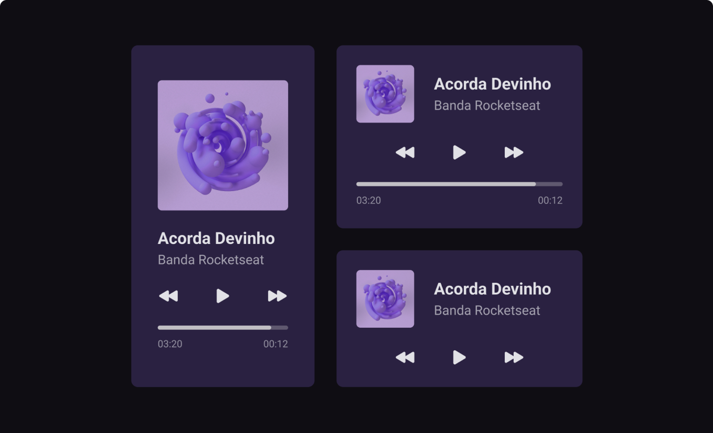

<h1 align="center"> Rocket Player 🚀 </h1>

1º Desafio do #boraCodar - Player de Música  
<a href="https://boracodar.dev/?utm_source=discord&utm_medium=organic&utm_campaign=trafego&utm_term=boracodar&utm_content=PGacao-lp_boracodar-discord">Link do Desafio</a>

  <a href="#-tecnologias">Tecnologias</a>&nbsp;&nbsp;&nbsp;|&nbsp;&nbsp;&nbsp;
  <a href="#-projeto">Projeto</a>&nbsp;&nbsp;&nbsp;|&nbsp;&nbsp;&nbsp;
  <a href="#-layout">Layout</a>&nbsp;&nbsp;&nbsp;|&nbsp;&nbsp;&nbsp;
  <a href="#memo-licença">Licença</a>

  

 

  

## 🚀 Tecnologias

Esse projeto foi desenvolvido com as seguintes tecnologias:

- React
- HTML e CSS
- Typescript
- Git e Github
- Figma

## 💻 Projeto

O Rockeat Player é o um protótipo de player de música, nesse projeto você vai encontrar somente a estrutura HTML e estilização. 

- [Acesse o projeto finalizado, online](https://maykbrito.github.io/devlinks)

## 🔖 Layout

Você pode visualizar o layout do projeto através [DESSE LINK](<https://www.figma.com/file/UBDSSK24EXLnXqNXhhUkDk/%23boraCodar---Desafio-1-(Copy)?node-id=1%3A282&t=dutDfVFkqDP7dB6b-0>). É necessário ter conta no [Figma](https://figma.com) para acessá-lo.

## :memo: Licença

Esse projeto está sob a licença MIT.

---

Feito com ♥ by Gustavo Salviato :wave:
